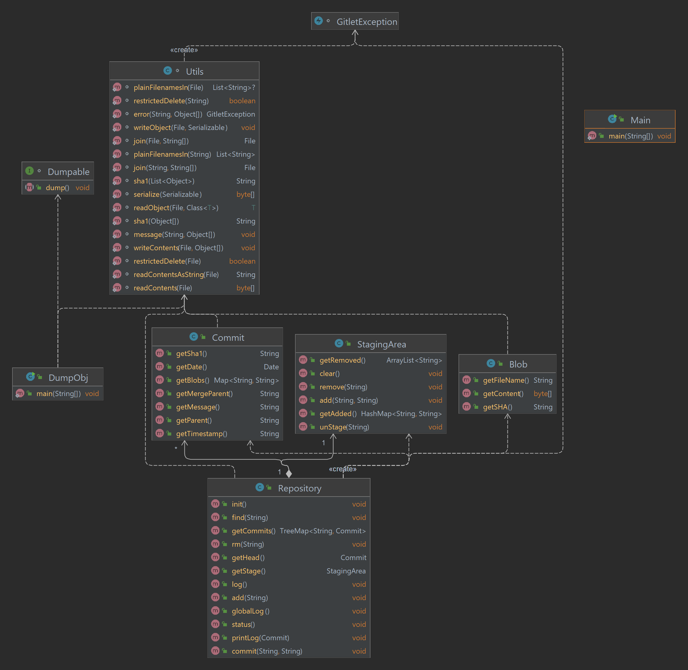

# Gitlet Design Document

**Name**: Elaraby Elaidy

# Classes and Data Structures

# Structur of working directory 
.
├── ...
├── .gitlet                                
│   ├── Commit            
│   ├── Blobs   
|   ├── staging.txt           
│   ├── Branches 
│       ├── HEAD 
|       ├── master
└── 

## Commit

### Fields
1. **Sha1:** The SHA-1 hash of the commit.
2. **message**: The commit message.
3. **parent**: sha of parent commit. 
4. **mergeParent**: The merge parent commit.
5. **timeStamp**: The time stamp of the commit.
6. **blobs** : hashmap conatins file name key and sha1 val of file of all blobs in the commit. 
7. **date** : the date of the commit.

### Methods
- **constructor**: constructor of the commit class, initial commit is made with empty parent and merge parent and date(0).
- **getSha1**: returns the sha1 of the commit, serialize the content of commit with "commit" distinct from other sha1s. 
- **getMessage**: returns the message of the commit.
- **getParent**: returns the parent of the commit.
- **getMergeParent**: returns the merge parent of the commit.
- **getTimeStamp**: returns the time stamp of the commit formatted.
- **getBlobs**: return blobs exisiting in the commit. 
- **getDate**: returns the date of the commit.

### Blob

### Fields

1. **SHA:** The SHA-1 hash of the blob. 
2. **content:** content of the source file as a stream of bytes. 
3. **fileName:** name of the source file.

### Methods
- **constructor**: constructor of the blob class, initial blob is made with empty content and fileName.
- **getSHA**: returns the sha1 of the blob, serialize the content of blob with "blob" distincted from other sha1s. 
- **getFileName**: returns the fileName of the blob. 
- **getContent**: returns the content bytes of the blob.

### StagingArea

#### Fields

1. Field 1
2. Field 2

## Repository

### Fields

1. Field 1
2. Field 2

## Methods
- **Status**: 
    - **Print Branches**find the master branch denoted it with * add rest of branches. 
    - **Print Staged files**: read content of stage file add all file to staged list. 
    - **Print Removed files**: files staged to remove. 
    - **Print Modified files**:. 
        - tracked in the current commit, changed in cwd, but not staged for commit. 
        - staged but with diffrent content than the WD. 
        - staged for addition, but deleted the WD. 
        - Not staged for removal, but tracked in the current commit and deleted from the working directory.  
    - **Print Untracked files**: files not tracked if it is not staged or tracked and present in WD .

- **CheckOut1**: back in time to the previous version of file.
    - overwrite the content of the file with the content of the file commit in the head commit. 
    - find file in head commit by name and get the sha1 of the file, read content of the path blob/sha. 
    - write the content of blob/sha in cwd/filename. 

- **CheckOut2**: overwrite content in the wd with the specfiied file in the specified commit.  
    - takes two args commit id and file name.
    - find the file name in the commit and overwrite the content of that file in the wd.
  

## Algorithms

## Persistence
